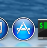
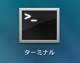
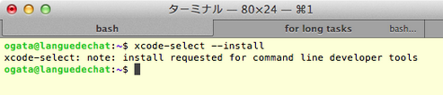
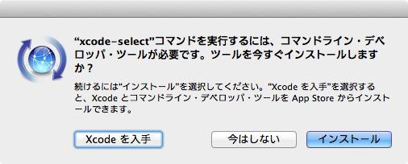
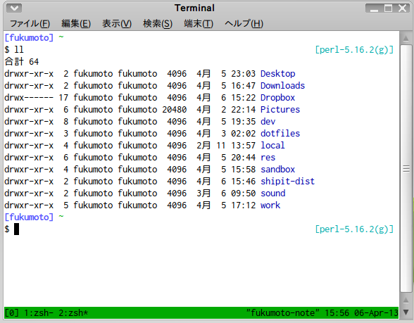
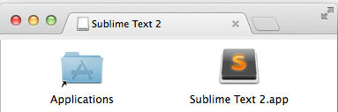

<!-- このファイルは直接編集せずに src ディレクトリ内のファイルを編集し build.pl を実行してください。 -->
# OSについて
___
## OSとは?
- OSは, Operating System(オペレーティング･システム)の略です.
- 私達のパソコンには, 大抵の場合1つ以上のOSが搭載されていて, OSの上でブラウザなどのアプリケーションが動作しています.
- 代表的なOSとして, 次のようなものが存在します.
    - Windows
    - Mac OS X
    - Linux

___
## Perlに最適なOSは?
- Perlを利用したWebアプリケーションなどのプログラミングにチャレンジする方は, ｢Windows以外｣のOSを利用することを推奨します.
    - これは, ｢Windows特有のトラブルが多いこと｣, ｢WindowsでPerlを使っているユーザが少なく, トラブル発生時に対処出来る人が少ないこと｣が理由です.
- Perlだけでなく, PHPやRubyでもこの傾向があるように思います.

___
## Linuxか? Macか?
- Linuxの利点は, 基本的に無料で使えるという点です.
    - 初心者向けのUbuntu, よくサーバで利用されるCentOS, コアな人気を誇るGentooなど, 多くの種類(ディストリビューション)が存在します.
    - Windowsとの共存も可能なので, Windowsユーザの方はひとまずLinuxを使ってみるのがいいのではないでしょうか.

___
## Linuxか? Macか?
- 基本的にWindows製のソフトウェアはLinux上では動かないと思いましょう.
    - 特にOfficeが使えないのは(場合によっては)致命的となり得ます.
    - WindowsとLinuxを用途に応じて使い分ける必要があるでしょう.

___
## Linuxか? Macか?
- 一方, MacはMacBook AirやMacBook ProなどApple製のPCに搭載されています.
    - Linuxと同様, 基本的にWindow向けのソフトウェアはMac上では動きません.
    - ただし, Officeについては, MicrosoftがMac版を販売しているので利用することができます.
- その他, ソフトウェアによってはWindowsだけでなくLinuxやMacにも対応したものを配布している場合があります.

___
## Perl入学式では...
- Windowsユーザの方は...
    - USBメモリを利用して, Lubuntuの環境を構築します.
    - USBを利用すれば, どの環境でもLubuntuを利用することができます.
- Macユーザ, Linuxユーザの方は...
    - 基本的に, 既にお手持ちのPC/環境を利用して頂きます.
    - Macの場合, 後々必要になる可能性が高い｢Xcode｣及び｢Command Line Tools for Xcode｣の導入を行います.

---
# Xcodeの インストール

〜Macユーザ向け〜

___
## Xcodeとは?
- Xcodeは, アップルが提供する統合開発環境です.
- Perlを開発する上で, 正確に言えばXcodeは必要ありません.
    - ですが, Perl入学式で利用する｢plenv｣を使ってPerlをインストールする場合, Xcodeからインストールできる｢Command Line Tools for Xcode｣が必要になります.
- ｢Xcode｣も｢Command Line Tools for Xcode｣も, 無料で利用することができます.

___
## Xcodeのインストール
- XcodeはApple Storeからインストールすることができます. 
    - Apple Storeから｢Xcode｣を検索し, インストールしましょう.
    - インストールには30分程時間がかかります.

 
△Apple Storeのアイコン

___
## CLT for Xcodeのインストール
- 続いて, Command Line Tools for Xcodeをインストールします.
    - Qiitaの[MavericksでCommand Line Tools for Xcodeをインストールする](http://qiita.com/3yatsu/items/47470091277d46f3fde2)という記事を参考にして, XcodeからCommand Line Tools for Xcodeをインストールしましょう.
- なお, OSのバージョンがMavericksの場合, 次に紹介するターミナルからインストールする方法も利用できます. 

___
## ターミナルを使う方法
- Launchpadなどから｢ターミナル｣を選択し, 起動します.
    - 今後, 記述したプログラムを実行する作業などは全てターミナルから行います.
    - 頻繁に起動するため, Dockへ追加しておくことをおすすめします.

 
△Ternimalのアイコン

___
## ターミナルを使う方法
    $ xcode-select --install

- ターミナルに上記のコマンドを打ち込み, Enterキーで入力します.

 
△Command Line Tools for Xcodeを インストールするコマンド

___
## ターミナルを使う方法
- コマンドを打ち込むとダイアログが表示されるので, あとはダイアログの指示に従ってインストールを進めて下さい.

___
## CLT for Xcodeのインストール
- 以上でXcodeとCommand Line Tools for Xcodeのインストールは終わりです.
    - お疲れ様でした!

---
# Lubuntu環境の構築

〜Windowsユーザ向け〜

___
## Lubuntuとは?
- Canonicalの支援で開発されている, Linuxディストリビューションの1つ, UbuntuをベースとしたOSです.
    - Ubuntuよりも比較的軽量で, スペックの低いマシンでも動作しやすい, という特徴があります.
- LubuntuやUbuntuは, 比較的初心者向けのディストリビューションと呼ばれています.
    - 国内外を問わず, 多くのユーザがUbuntuやLubuntuを利用しています.

___
## ISOの入手

- まず, いずれの場合でも必要になるLubuntuのISOデータを用意しましょう.
    - [http://www.ubuntulinux.jp/download/ja-remix](https://help.ubuntu.com/community/Lubuntu/GetLubuntu/LTS)
    - なお今回は, ｢Lubuntu 14.04.2｣を利用します.
    - 32bit/64bitはお使いのPCのCPUにあわせて選択して下さい.
- こちらのリンクから直接ダウンロードすることも可能です.
    - [32bit版ISOダウンロード](http://cdimage.ubuntu.com/lubuntu/releases/14.04/release/lubuntu-14.04.2-desktop-i386.iso)
    - [64bit版ISOダウンロード](http://cdimage.ubuntu.com/lubuntu/releases/14.04/release/lubuntu-14.04.2-desktop-amd64.iso)

___
## Lubuntuのインストール
- Lubuntuのインストール方法については, [こちら](https://github.com/perl-entrance-org/workshop-2015-01/blob/master/src/lubuntu_install_usb.md)の資料を参照して下さい.

---

___
# ターミナルとシェル入門

___
## CUI
- MacもLubuntuも, Windowsと同じくGUIで操作可能です.
- ですが, プログラミングをする上でCUIは避けられません.
    - CUI ... Character User Interface
    - 文字によって操作を行うインターフェイスのことを指します.
    - Windowsならば, コマンドプロンプトに該当します.

___
## CUI
- 基本的なCUIの操作を, 実際に操作しながら体験してみましょう.
    - 一部コマンドはLubuntuのみでしか利用できず, Macのターミナルでは使えませんのでご了承下さい.

___
## ターミナルとシェル
- ターミナルを開くと, シェルを使った操作が出来るようになります.
    - プログラムの起動や制御をCUIで行うプログラムのことをシェルと呼びます.

___
## ターミナルの開き方(Lubuntu)

- 下部にあるバーの一番左側にあるボタンをクリックしてメニューを開き, ｢Accessories｣を選択してから｢LXTerminal｣をクリックして, 端末を起動します.

___
## ターミナルの開き方(Mac)

- Launchpadなどから｢ターミナル｣を選択し, 起動します.
    - 再掲ですが, ターミナルは頻繁に起動するため, Dockへ追加しておくことをおすすめします.

 
△ターミナルのアイコン

___
## シェルで使えるコマンド集
- Perl入学式の中でもよく使うコマンドを紹介します.
    - シェルには, これから紹介する以外にも様々なコマンドがあります.
    - OSやシェルの種類によって使えるもの, 使えないものがありますが, 使いこなせば作業の負担を軽減することができるでしょう.

___
## コマンド集(ls)
    $ ls
    デスクトップ ダウンロード (以下略)

- `ls`は, 現在居るディレクトリにあるファイルを表示します.
- `ls -a`は, ファイルを**全て**表示します.

___
## コマンド集(pwd)
    $ pwd
    /home/username

- `pwd`は, 現在居るディレクトリを表示します.

___
## コマンド集(mkdir)
    $ mkdir sample
    $ ls
    sample デスクトップ ダウンロード (以下略)

- `mkdir DIRECTORY`は, `DIRECTORY`というディレクトリを作ります.

___
## コマンド集(cd)
    $ cd sample
    $ pwd
    /home/username/sample
    $ cd ..
    $ pwd
    /home/username

- `cd DIRECTORY`は, `DIRECTORY`に移動します.
    - 上のディレクトリは`..`で示します.

___
## コマンド集(rm)
    $ touch sample1 sample2
    $ ls
    sample1 sample2
    $ rm sample1
    $ ls
    sample2

- `rm [OPTION] FILE`は, `FILE`を削除します.
    - `target file`は半角スペースで区切ることで複数個指定することができます.
- ディレクトリを削除するときは, `[OPTION]`として`-r`を指定し, `rm -r FILE`で削除しなければなりません.
    - `r`は再帰(recursion)を意味します.

___
## コマンド集(cp)
    $ ls
    sample2
    $ cp sample2 sample1
    $ ls
    sample1 sample2

- `cp [OPTION] SOURCE DEST`は, `SOURCE`を`DEST`にコピーします.
- ディレクトリをコピーするときは, `[OPTION]`として`-r`を指定し, `cp -r SOURCE DEST`でコピーしなければなりません.

___
## コマンド集(mv)
    $ ls
    sample1 sample2
    $ mv sample1 sample_text
    $ ls
    sample_text sample2

- `mv [OPTION] SOURCE DEST`で, `SOURCE`を`DEST`に移動します.
    - ファイルやディレクトリの名前を変更する為にも使えます.

___
## コマンド集(nautilus)
    $ nautilus .

- `nautilus DIRECTORY`で, `DIRECTORY`をnautilusというファイルマネージャで開きます.
- 現在のディレクトリは`.`です.
- Macにはnautilusが搭載されていないので, 使えません.

___
## コマンド集(open)
    $ open .

- `open DIRECTORY`で, `DIRECTORY`をFinderというファイルマネージャで開きます.
    - `open`は対象となるファイルの種類によって動作が変わります.
    - 例えばディレクトリが対象ならば上記のようにFinderで表示, テキストならばテキストエディタで表示...  という動作をします.
- Lubuntuでは利用できません.

___
## 練習問題
- ホームディレクトリに`perl-entrance`というディレクトリを作ろう.
- 作った`perl-entrance`ディレクトリに移動しよう.
- カレントディレクトリ(`perl-entrance`)を, `nautilus`もしくは`open`を使って, ファイルマネージャで開いてみよう.

---
# エディタ入門

___
## エディタ
- コードを書く時に最も使う道具, それがエディタです.
- プログラミングに特化した様々なエディタが開発されていますが, Perl入学式ではその中でもSublime Text2を紹介します.
    - 特にこだわりのない方はSublime Text2を試してみましょう.
    - もちろん, EmacsやVimなど, 既に使い慣れているエディタがある方はそちらをお使いください.

___
## インストール for Lubuntu
- [http://www.sublimetext.com/](http://www.sublimetext.com/)へアクセス, サンプルムービー下部の｢Download｣ボタンからダウンロードします.
- ダウンロードしたファイルを右クリックして, `ここに展開する`をクリックします.
- `Sublime Text2`というフォルダができるので, その中の`sublime text`をクリックして起動します.

___
## インストール for Mac
- [http://www.sublimetext.com/](http://www.sublimetext.com/)へアクセス, サンプルムービー下部の｢Download｣ボタンからダウンロードします.
- ダウンロードした｢Sublime Text 2.x.x.dmg｣(xは任意の数字)をダブルクリックし, 開いたウィンドウにある｢Sublime Text 2.app｣を｢Application｣にドラッグすればインストールは完了です.

 
△｢Sublime Text 2.x.x.dmg｣ダブルクリック後の画面

___
## インストール for Mac
- Finderの｢アプリケーション｣から, ｢Sublime Text 2.app｣をダブルクリックして起動します.
- これから頻繁に利用するので, Dockに登録しておくことをおすすめします.

___
## 練習問題
- Sublime Text2など, 好きなエディタで`perl-entrance`ディレクトリに`profile.txt`というファイルを用意しましょう.
    - ファイルの中には, あなたの自己紹介を書きます.
- ターミナルを使って, `profile.txt`を`profile2.txt`という名前でコピーしよう.
- コピーした`profile2.txt`をターミナルから削除しよう.

---
# Perl入学式

---
# Perl入学式について

___
## Perl入学式とは
- 2011年度に大阪で開始された, プログラム初心者向けのPerl勉強会です.
- 2012年度では東京, そして2013年度では福岡と, 3年目にして3大都市で開催!
- 基本的に参加費無料, 受講者の負担が極力少ない形で行われています.
- 隔月開催で年6回のカリキュラム, 出られない場合には奇数月に同じカリキュラムの補講が行われます(どちらに参加されてもOK).

___
## 2012年度のPerl入学式
- 大阪と東京で(補講を含めて)毎月開催達成.
- 講師とサポーターでより良い勉強会のあり方を考える.
- 2012年度の参加者から今年度のサポーターになった方も若干名います.
- 結果的に他のプログラム言語を含めてPerlの初心者向け勉強会としては一応成功に終わりました.

___
## 今年度のPerl入学式について
- 受講者の負担が少ない形は維持していきます.
- 受講者と運営側の交流を増やして, より楽しく勉強ができる機会を増やします.
- 懇親会での交流促進. 懇親会への参加を昨年度より気軽にできるようにしました. 受講者の皆さんと, 講師・サポーター・運営側との交流の機会も増やします.

___
## Perl入学式の使い方
- 今流行のウェブアプリケーションを作ってみたいものの, 基礎から勉強したい人.
- Perl以外の他の言語を学習することになったものの, 初心者を対象とした丁寧な勉強会が無いということでPerl入学式を利用してくださってもOKです.
- 前年度までは, 他の言語を既に習熟した方がPerlを学習する際の補助的教材という位置付けで受講して下さった方もいらっしゃいました.
- 皆さんの学びたい・作りたいをサポートします.

___
## オンラインでのサポート
- Perl入学式の公式ページ http://perl-entrance.org/
- Twitterアカウント @[PerlEntrance](https://twitter.com/PerlEntrance)
    - 公式ページやTiwtterアカウントでは, 開催日程などがアナウンスされます.
- Twitterハッシュタグ #[PerlEntrance](https://twitter.com/search?f=realtime&q=%23PerlEntrance)
    - 運営側がウォッチしているので, なにか疑問があればこれをつけて気軽に質問してみましょう
- [GitHubのPerl入学式アカウント](https://github.com/perl-entrance-org). 講義で使われたコードなどがあります.

---
# Perlという言語について

___
## Perlって何?
- 1987年, Larry Wall(右写真)が開発したプログラミング言語です.

    - Ruby, Python, PHPと並ぶLL言語(Lightweight Language)の一種になります.
    - C言語やsed(せど), awk(おーく)の影響を受けた動的型付け言語です.
    - 後のRubyやPHPに影響を与えました.
    - ｢Perl｣は言語そのもの, ｢perl｣はその処理系を示します.

___
## Perlの特徴
- [Wikipediaの記事](http://ja.wikipedia.org/wiki/Perl)から重要なものだけ引用します...
    - 強力な文字列処理. 正規表現をサポート.
    - 日本語をはじめとして世界中の言語を処理可能.
    - 自由度の高い文法. 簡潔にプログラムを記述できる.
    - 高い後方互換性を持つ.
    - 数多くのオペレーティングシステムで利用可能.
    - プログラムの実行には事前コンパイルは不要.
    - 有志によって開発された豊富なモジュール.

___
## TMTOWTDI
- Perlのスローガン. ｢ティムトゥーディー｣と読みます.
    - "There's more than one way to do it."
    - ｢やり方はひとつじゃない｣.
- Larryは｢プログラミング言語は, いろんな対象をシンプルに記述する為にある程度複雑でなければならない｣と信じています.
    - Perlは, 同じ意味を持つ処理をいろいろな書き方で表すことができます.

___
## 簡潔にプログラムを書ける
    my $number = 123;
    my $string = 'perl';
    print $string . $numbrer . "\n";

- 動的型付け言語なので変数に型は存在しません.
    - `my`というのはスコープの違いを示す. これは明示的に指示する必要があります.
- C言語やJavaのような, 型のキャストなどは必要ありません.
- よって, このように数値を格納した変数`$number`と, 文字列を格納した変数`$string`を直接文字列として結合(`.`演算子によって)できます.

___
## 高い後方互換性
- Perlのバージョンアップによって昔のスクリプトが動かなくなる, ということはほとんどありません.
- もちろん, Perlもバージョンアップによる細かい機能変更はあります.
    - しかし, 基本的な処理については後方互換性が相当繊細なまでに維持されています.

___
## Perl5 のバージョンの歴史
- Perl4以前は前史として, 既に周囲に環境が存在しないと思って良いです.
- Perl5.00x(xは数字)というバージョンでPerl5が登場しました. 1994年のことです.
- Perl5.6が登場. 2000年. この頃からインターネットやウェブというものが徐々に一般に普及していきます.
- Perl5.8が登場. 2002年. 国際化対応や今につながる様々な機能が搭載されます. 5.8時代が長かったため, 多くの企業等に長きにわたって使われ続けました.

___
## Perl5 のバージョンの歴史
- Perl5.10が登場. 2007年. 後方互換性を損ねない構文拡張等を行います.
- Perl5.12が登場. 2010年.
- Perl5.14が登場. 2011年.
- Perl5.16が登場. 2012年.
- Perl5.18が登場. 2013年.
- Perl5.20が登場. 2014年. 現在の最新の安定版です. この講義もPerl5.20を使用します.

___
## Perl5 のバージョンの歴史
- 5.(偶数) が安定版. 5.(奇数) が開発版です.
- 基本的に最新版の一つ手前の安定版までがサポート対象です.
- Perl5.8時代が長かったので, 今もPerl5.8が生き残っている現場はあるものの, 今ならPerl5.10以降だけを考えれば良いです.
- Perl5.10以降から5.20まで, Perl初学者にとって大きな違いはあまりありません.

___
## 様々な環境で使用可能
- Linuxのほとんどのディストリビューションで標準装備となっています.
    - システムを管理する多くのツールがPerlで書かれているためです.
- Pythonもほとんどのディストリビューションで標準装備しています.
    - 但しほとんどがPython2.
- Rubyを標準で装備するディストリビューションはまだ少ないです.
    - Macは標準装備, Mountain Lionは1.8, Mavericksは2.0.

___
## 豊富なモジュール
- CPANと呼ばれるアーカイブに, 全世界のPerl Mongerがモジュールを投稿しています.
    - Perl Monger ... Perl使いのこと. RubyにおけるRubyist, PythonにおけるPythonistaと同義です.
- 例: Encode ... 文字列のエンコードを処理するモジュール.
- 例: Net::Twitter ... TwitterのAPIを操作するモジュール.
- 例: DBD::SQLite ... Perlから, SQLiteのデータベースを操作するモジュール.

___
## 余談: Perl6について
- Perl5とは別に, Perl6も開発されています.
    - 当初はPerl5の後継となるはずだったが, 後に｢Perl5とは別に開発を進める｣と公式に発表されました.
    - よって, Perl5の開発は継続されます.
    - また, 現在ではPerl6はPerl5とは別の言語とみなされている, と解説されることもあるほど互換性はありません. これはPerl5のバージョン間での互換性が最大限に保たれていることの裏返しでもあります.
    - 現在の最新版は5.18.2, バージョンを確認する `perl -v` では, Perl5のバージョン18.2と表記されます.

___
## Perlのコミュニティ
- 世界各地にPerl Monger(PM)のコミュニティが存在します.
    - 地域のPerl Mongrerコミュニティは, (地名).pmを名乗ることが多いです.
    - 日本でも, 十数個のコミュニティ, 勉強会が開催されています.

___
## 地域コミュニティ
- pm.orgに登録されている, 公認のコミュニティ.
    - Hokkaido.pm, Kushiro.pm, Sendai.pm, Niigata.pm, Tokyo.pm, Shibuya.pm, Yokohama.pm, Kamakura.pm, Gotanda.pm Nagoya.pm, Kansai.pm, Kyoto.pm, Fukuoka.pm
- 非公認のコミュニティ
    - Hachioji.pm, Namba.pm, ...
- 勉強会/イベント
    - Hokkaido.pm Casual, Perl Casual, Perl Beginners, Perl入学式, ...

___
## YAPC::Asia Tokyo
- YAPC ... Yet Another Perl Conference
    - 年に一度行われる, 日本最大規模のPerlの祭典です.
- 今年は8月20日から22日の3日間開催です. [YAPC::Asia Tokyo 2015](http://yapcasia.org/2015/).

___
## Perlを使っている会社

- LINE, DeNA, Seesaa, はてな, カヤック, mixi, Mobile Factory, FreakOut, GaiaXなどもPerlを活用しており, 優秀なPerl Mongerが数多く所属しています.
- 過去のYAPC::Asia Tokyoにスポンサーしていた会社はPerlを最大限に活用している, もしくは一部使っているか, Perlに対して興味を持っている企業です.
- Perlを使ったサービスとしては, はてなの｢はてなダイアリー｣やLINEの｢ライブドアブログ｣, オモロキの｢ボケて｣などが有名です.

___
## PerlとCGI
- 一時期, ｢PerlでWebサービスを作るならCGI｣という時代がありましたが, 今はそうではありません.
- 最近は, PSGI(Perl Web Server Gateway Interface)という仕様に対応したWAF(Web Application Framework)を使っての開発が増えています.
    - 2014年現在, Perlの代表的かつ新規採用されやすいWAFとしては, MojoliciousやAmon2などがあります.
- Perl入学式は｢モダンなPerlを教える｣という方針を取っていますので, CGIについては触れません.

---
# より深く学ぶには？

___
## 勉強会への参加
- 地域.pm への参加.
    - Hokkaido.pm(札幌), Yokohama.pm(横浜), Shibuya.pm(渋谷), Gotanda.pm(五反田), Kansai.pm(大阪), Kyoto.pm(京都), Fukuoka.pm(福岡), Namba.pm(PM非公式, 難波), Hachioji.pm(PM非公式, 八王子), Kichijoji.pm(PM非公式, 吉祥寺)など...
- 他のPerlの勉強会も活発.
    - Hokkaido.pm Casual(毎月第3水曜日, 札幌), Perl Casual(東京, 不定期), PerlBeginners(東京, だいたい隔月), Perl入学式(今参加しているコレ)

___
## 難しい内容かもしれないので不安
- 参加するだけなら怖くありません.
- 参加費も無料, もしくは会場費の割勘程度.
- こんな世界もあるんだ〜程度に聴講すると, 数年後にふと繋がることもある.
- 懇親会に参加して盛り上がると, さらに業界やPerl界隈の裏話が聴けたりも.

___
## 検索 vs 書籍
- 最近は検索(ググる)ことで解決することも多い. 
- ただそれだと体系的な勉強は出来ないので, 何らかの書籍を通読するのがオススメ.
- 書籍の最大の欠点は, 情報の陳腐化の影響をもろに受けること.
- また(書籍もそうだけれど, それより)ネットの情報は玉石混交.
- 最初は誰しも記号から分からないので, ググるにも手がかりが無い (`perldoc -v` / [perldoc.jp](http://perldoc.jp/) を活用しましょう).
- おすすめの書籍は人それぞれ.

___
## オススメの書籍
- 「プログラミングPerl」(通称: ラクダ本). プログラミング未経験の初心者にはハードルが高い. 時期が来るまで買うのを待っても良い.
- 「初めてのPerl」(通称: リャマ本). 若干プログラミング初心者向け. オライリーの文体に慣れていないと多少厳しいかも.

___
## オススメの書籍
- 「モダンPerl入門」2009年刊行. 今だと若干モダンではない記述もある. [増補改訂版の予定](http://codezine.jp/book/modernperl2)もあるらしいので期待.
- 「CPANモジュールガイド」CPANモジュールのガイド本. Perlの可能性を知るだけでも良書.
- 「雅なPerl」2013年刊行. 同人誌, とはいえ初心者向けという意味ではかなり秀逸な解説をしている.
- その他, 様々な対象者や内容の書籍がたくさんありますが, 割愛.

___
## ネットウォッチとTwitter
- ここ数年はTwitterでPerlの情報を流す人をフォローしておけば, 目的の情報が手に入る時代になった. 昔ほどRSSフィードリーダーが必須ではなくなった.
- 著名なPerl Mongerは数多いので, 検索すれば出てくるはず.
- 自分の興味のあるジャンルに携わっている人をフォローしておくとよい.
- Twitterで質問をつぶやけば, 誰かが助言してくれることも多数. #Perl入学式 のハッシュタグも活用してください.

___
## 最新情報はウェブでゲットする
- 今はまだ難しいとしても, 勉強が進んだら情報のアンテナを張ってみるのがオススメ.
- 最新情報は書籍ではなくネット発. その時にウォッチできる状態, またはそれをググれるキーワードを持っておく事は大事.

___
## 最新情報はウェブでゲットする
- 記号の勉強などを抜けだしたら, いよいよ検索して先人の知恵を拝借する
- ネットの情報は玉石混交なので, 実際にPerl Mongerと対面できる勉強会・懇親会の場も重要だし, **本当の**最新情報はそこから入る場合もある.
- このPerl入学式という場も, そういう最新のPerlをお伝えする場でありたいです.

---
# Perl環境の構築

___
## システムPerlとユーザPerl
- MacやLinuxなどの多くのシステムには最初からPerlが入っています。このPerlのことを **システムPerl** と呼ぶことがあります.
- もちろんシステムPerlをそのまま使っても良いのですが、今後モジュールを入れたりする際にシステムPerlの環境を汚すことを避けるために、自分専用のPerl環境 **ユーザPerl** を構築することが最近の主流です
- 今回はユーザPerl構築環境の一つ **plenv** を導入していきましょう

___
## システムPerlは使わないの？
- 最近のOSのシステムPerlのバージョンは新しいので、システムPerlで事足りる作業も多いです.
- 実はこのPerl入学式でも第5回目くらいまではシステムPerlで事足ります.
- ただ今後のことを考えてユーザPerlの構築を学んでいきましょう.
- Lubuntuでは`apt`によって、整合性のとれたシステムPerlへのPerlモジュール導入ができるので、`apt`で手に入るモジュールであれば、これでまかなうのもありでしょう.

___
## plenvの導入準備
    $ sudo apt-get install git curl build-essential ### Lubuntuのみ

- Lubuntuでは初期状態に`git`コマンドなどが入っていないので`apt-get`で導入します
- Macの場合は初期状態で入っている`git`コマンドが使えます
    - MacでPerl環境を構築するためのその他のコマンドは、先ほどのXcodeで完了しています

___
## plenvの導入
    $ curl -L http://is.gd/plenvsetup | sh

- ここでは, [@ytnobody](https://twitter.com/ytnobody) さんが作成した、[`plenv`簡単導入プログラム](http://yellowstore.blogspot.jp/2013/05/plenvrbenv.html)を使います.
- 上記のコマンドを打って下さい. しばらくかかるので気長に待ちましょう.
- 終わったら、`exit` して端末を開き直すか、`source ~/.bashrc`を実行してシェルの設定を読み直してください。

- `plenv` と打って、ヘルプが出たら成功です. `which plenv` などとして、`plenv` コマンドの場所を確認してみましょう.
- 簡単インストールコマンド詳細を確認したい方は `curl -L http://is.gd/plenvsetup | less` など打ってみましょう.

___
## plenvでのperlの導入
    $ plenv install 5.20.2

- 今回は2015年4月時点での最新の安定版 `perl-5.20.2` を導入します.
- これも時間がかかるので気長に待ちましょう.

___
## plenvでのperlの導入
    $ plenv versions 
    * system (set by /home/username/.plenv/version)
      5.20.2

- `plenv versions` で, 導入したPerl の一覧が見られます. `*` が付いているのが現在選択されているperlで, `plenv` 導入直前はシステムPerlが選択されているはずです.

___
## plenvでのperlの導入
    $ plenv global 5.20.2
    $ plenv versions
      system
    * 5.18.2 (set by /home/username/.plenv/version)

- `plenv global` コマンドで, 使うperlを切り替えることができます.

___
## 現在有効なperlの確認
    $ plenv version
    $ 5.20.2 (set by /home/ogata/.plenv/version)

- `plenv version` コマンドの他に、`perl -v` として実際にパスが通っている `perl` コマンドのバージョン情報を見るのが確実でしょう.

___
## 現在有効なperlの確認
    $ perl -v
    his is perl 5, version 20, subversion 2 (v5.20.2) built for darwin-2level
    (以下略)

- 今後は原則的に, `plenv`で作成したユーザPerlを使っていきます.

___
## plenv その他
- `plenv global system` と打つと, 現在のPerlをシステムPerlに戻すことができます.
- `plenv` とだけ打つと, 使えるコマンドの一部の説明が出力されます.
- 局所的な場所だけ違うバージョンのPerlを使う `plenv local` というものもありますが, 今回は `plenv global` だけ使います.

___
## モジュールとCPAN
    $ plenv install-cpanm

- 複雑な処理などを肩代わりしてくれる外部プログラムである**モジュール**がPerlには豊富に用意されています
- Perlのモジュールは**CPAN**(シーパン)という場所に集められていて, 誰もが自由に使うことができます.
- インストールはネットワーク経由で行うことができ, そのためのコマンド`cpanm`が用意されています.
- 上記コマンドで`plenv`から`cpanm`を導入することが出来るので, やってみましょう.

___
## モジュールを活用していこう
- Perlには最初から搭載されて使用できるモジュールも存在して, コアモジュールと呼ばれます
- `cpanm`コマンドを使って, CPANから外部モジュールを入れることも簡単にできます
- 多くのモジュールを組み合わせて活用すれば, 様々な複雑な処理や自分一人では書ききれない処理を簡単に書くことができます.

___
## ワンライナー

    $ perl -E 'say "Hello World!";'
    Hello World!
    $ perl -E 'say 12+23;'
    35

- `perl` コマンドでは `-e` もしくは `-E` の後に直接プログラムを書いて実行することができます.
    - この他に `-M` オプションを使うことでモジュールを使う(`use` する)ことができます

___
## ワンライナーとモジュール

    $ perl -MTerm::ANSIColor -E 'say colored("Hello World!", "bold blue");'

- `Term::ANSIColor` モジュールを使って文字を色付きで表示させてみましょう.
    - `Term::ANSIColor` はコアモジュールなので, どこでも使うことができます.

___
## perldocとドキュメント    
    $ perldoc Term::ANSIColor

- 使い方は `perldoc Term::ANSIColor` と打つと読めます (英語ですが). `colored` というサブルーチンが使えることがここでわかります.
- モジュールには使い方のドキュメントがついていて、`perldoc` コマンドで読むことができます.
- 実際にエディタを使ってPerlプログラムを書いていく際は, これらのモジュールを `use` を使って読み出します.

___
## FizzBuzz問題とAcme
- `Acme::FizzBuzz` というモジュールを使って, FizzBuzz問題を自動で解いてみましょう.
- FizzBuzz問題とは, 数字が3で割り切れたらFizzを, 数字が5で割り切れたらBuzzを, 数字が3でも5でも割り切れたらFizzBuzzを, そうでなければ数字を出力するプログラムのことです.
- `Acme` というのは, CPANにおいてジョークなモジュールの為に用意された名前空間です.
- ルーニー･テューンズのロードランナーの中に出てくる, コヨーテに怪しい商品を売るAcme社から来ている... らしい.

___
## モジュールをインストールしてみよう

    $ cpanm Acme::FizzBuzz
    $ perl -MAcme::FizzBuzz -E ''

- インストールが完了したら、あとはこのモジュールを読み込むだけでFizzBuzz問題を解決してくれます.

___
## PerlとモジュールとCPANの世界
- CPANには, ジョークのようなモジュールから, ウェブプログラミングを支援するためのモジュール, TwitterやFacebookなどにアクセスして情報を取得するためのモジュールなど, ありとあらゆるものがあります.
- あなたの趣味や仕事を助けてくれるモジュールがきっとあるはずです. CPANを検索して自分が必要な処理を肩代わりするモジュールを使うことができるレベルまで, まずは少しずつPerlを勉強していきましょう.

---
# Hello, World!

___
## 最初のプログラム
- どのプログラミング言語でも, 最初に解説されるのは「Hello, World! と表示するプログラム」であることが多いです.
- というわけで, 先ほど構築したPerl環境を使って, Hello, World! を表示するPerlプログラムに挑戦してみましょう.
    - これは端末上に `Hello, World!` という文字列を表示するプログラムです.

___
## Hello, world!
    print "Hello, world!\n";

- エディタにこのようなプログラムを書いて, `hello.pl`という名前で保存しましょう.
    - Perlのスクリプトは`.pl`という拡張子で保存することが多いです.
    - Sublime text2では, `File` -> `Save`で保存できます.
- `print`は, 端末に文字を出力する命令です.
    - `\n`は改行を意味します.
- 文の最後にはセミコロン(`;`)を付けましょう. 文の区切りという意味です.
    - C言語を知っている方は馴染み深いでしょう.

___
## スクリプトの実行
    $ perl hello.pl
    hello, world!

- `perl`の引数に, 実行したいスクリプトファイル名を与えると, そのスクリプトを実行してくれます.

___
## 練習問題
- print命令を複数個使って, あなたのプロフィール(名前, 年齢, 大学etc...)を表示するスクリプトを書いてみよう.
    - スクリプトの名前は`profile.pl`として, 実行してみましょう.
    - print命令を複数書く場合にはセミコロンで文を区切りましょう.
    - セミコロンの後に改行を入れて複数の行にして読みやすくするのが通常です.

___
## 練習問題
- print 5-2; とすると3が表示されます(ダブルクォートはしません). では, 2014からあなたの生年の西暦を引き算して, 満年齢を表示してみましょう.
    - 改行を入れる場合, セミコロンで文を分けて, 次に `print "\n"` を書くなど, 色々試してみましょう (色々な方法があります).
