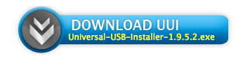
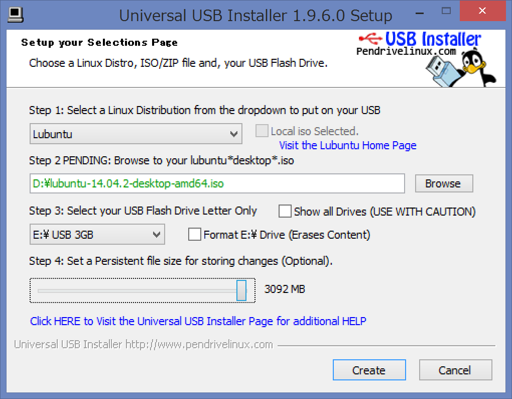
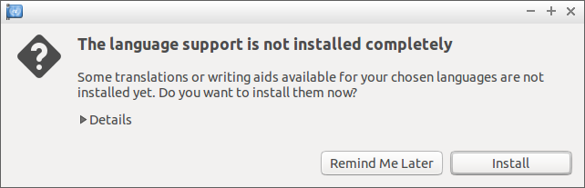
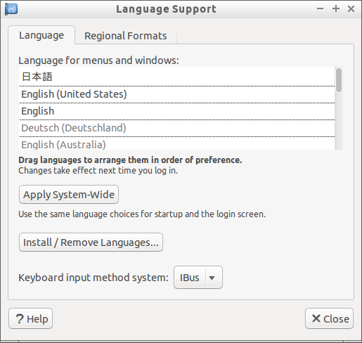
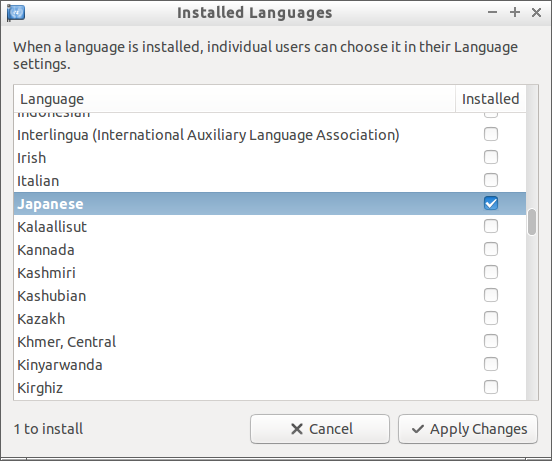

# Lubuntu環境の構築

## Lubuntu Bootable USB
- まず, WindowsからLubuntuを起動することができるBootable USBの作成方法について解説します.
- Bootable USBを使うことで, Lubuntuの環境をお手軽に用意し, お手軽に試すことができます.
    - Lubuntu Bootable USBをWindows PCに差し込めば, どこでもLubuntuを実行することができます.
- また, 今回は説明を省きますが, HDDにWindowsとLubuntuをインストールして併用する｢デュアルブート｣の環境を設定する際にも, Bootable USBが必要となります.

## 注意!
- Lubuntuのデスクトップにある｢Install Lubuntu 14.04.2 LTS｣を押して, HDDにLubuntuをインストールを進めてしまうと, 既にインストール済みのWindowsを上書きしてLubuntuをインストールしてしまいます.
    - **デスクトップ上や, デスクトップ左側にある｢Install Lubuntu 14.04.2 LTS｣は絶対に選択しないで下さい!**
    - 資料に基づいて, Lubuntu上の画面から｢Install Lubuntu 14.04.2 LTS｣を削除することを推奨します.

## UUIの入手

- WindowsでLubuntuのBootable USBを作るためのソフトウェア, ｢Universal USB Installer｣を入手します.
    - 略して｢UUI｣.
    - [http://www.pendrivelinux.com/universal-usb-installer-easy-as-1-2-3/]

 
△UUIのダウンロードリンク

## USBメモリの用意

- Lubuntu環境を構築するUSBメモリを用意し, PCに接続します.
    - 既存のデータは, Lubuntu環境の構築によって消える可能性があるため, **予め必ずバックアップを取って下さい.**
    - 可能であれば, フォーマットをかけておくことをおすすめします.

## Bootable USBの作成

- ダウンロードしたUUIを起動します.
- ｢Step 1: Select a Linux ...｣は, ｢Lubuntu｣を選択します.
- ｢Step 2 PENDING: Browse to your ...｣は, ｢Browse｣を選択して, ダウンロード済みのLubuntuのISOを選択します.

## Bootable USBの作成
- ｢Step 3: Select your USB ...｣は, Lubuntuの環境を構築するUSBメモリを選択してください.
    - ｢We will format ...｣のチェックボックスを選択します.
    - このとき, ｢Show all Drives｣のチェックボックスは**絶対に選択しないでください.**
- ｢Step 4: Set a Persistent file size ...｣は, 適当な数値に設定しておきます(1024MB以上にしておくことを推奨します).

## Bootable USBの作成

- 次のような状態になっていればOKです.

## Bootable USBの作成

- 問題なければ｢Create｣を選択します.
- 次に出るポップアップは作業内容が表示されます. インストール先がUSBであることを確認しましょう.
    - 問題なければ｢はい (Y)｣をクリックし, 環境構築を開始します.

## Bootable USBの作成

- 作業完了後, ｢Close｣でUUIを終了してから, PCを｢再起動｣します.
    - 再起動時に, Windowsが導入済みのHDD/SSDではなく, Lubuntu環境が構築されたUSBメモリを読み込むことによって, USBメモリに構築したLubuntu環境を利用します.

## Bootable USBの作成
- Lubuntu起動後, デスクトップに｢Install Lubuntu 14.04.2 LTS｣というアイコンがありますが, **このアイコンは絶対に起動しないでください.**
    - アイコンをダブルクリックして起動し, Lubuntu 13.10のインストールを進めた場合, **既にHDDに導入済みのWindowsが消去(Lubuntuで上書き)されます.**

## Lubuntuの起動
- 再起動時, ｢F12｣キーなどを連打してブートメニューを開いてください.
    - HDDやUSBメモリなど, どのデバイスから起動するか選択できますので, 作成したBootable USBを選択して下さい.
- ブートメニューが開けない場合(開き方がわからない場合), ｢PCの機種名｣と｢ブートメニュー｣で検索すれば開き方がわかる場合が多いです.

## Lubuntuの起動
- 無事にUSBメモリから起動することに成功すれば, ｢GNU GLUB｣というメニューが表示されます.
    - 一番上の選択肢である｢Try Lubuntu without installing｣を選択し, Enterを押して下さい.

## インストール機能の削除
- デスクトップにある｢Lubuntu 13.10のインストール｣を無効にするため, USBからのインストール機能を取り除きます.
- まず, 下部にあるバーの一番左側にあるボタンをクリックしてメニューを開き, ｢Accessories｣を選択してから｢LXTerminal｣をクリックして, 端末を起動します.

## インストール機能の削除

    lubuntu@lubuntu:~$

- この後に, `sudo apt-get remove ubiquity`と入力して, エンターキーを押します.
    - `Do you want to continue? [Y/n]?`には｢y｣を入力して, エンターキーを押します.
    - これでインストール機能の削除は完了です. デスクトップ上に残った｢Install Lubuntu 14.04.2 LTS｣アイコンは削除してしまいましょう.

## 日本語化

- 最後に, Lubuntuを日本語化します
    - ｢[Lubuntu 14.04 その1 - 日本語環境の構築と確認・インターネットに接続せずLubuntuをインストールした時は](http://kledgeb.blogspot.jp/2014/04/lubuntu-1404-1-lubuntu.html)｣と同じ処理を行います

### 日本語化

- 下部にあるバーの一番左側にあるボタンをクリックしてメニューを開き, ｢Preference｣を選択してから｢Language Support｣をクリックします.

### 日本語化
- すると, 次のようなウィンドウが出るはずです.
    - ｢install｣をクリックします

### 日本語化

- 次のような画面が出力されるはずです.
    - 問題なくインストールが終わっていれば, ｢Language for menues and windows:｣の中に｢日本語｣があるはずですので, それをクリックして一番上になるようにドラッグします

### 日本語化

- ｢Language for menues and windows:｣の中に｢日本語｣がない場合, ｢Install / Remove Languages...｣をクリックします
    - ｢Language｣のリストから｢Japanese｣を見つけて, 右の｢Installed｣をチェックします
    - その状態で｢Apply Changes｣をクリックすればOKです

### 日本語化

- この状態で再起動すると, Lubuntuの表示が英語から日本語に変化するはずです
- 再起動時, ｢標準フォルダーの名前を現在の言語に合わせて更新しますか?｣と表示がされます
    - これはどちらを選んでも構いません

## Lubuntu環境の構築
- 以上でUSBメモリを利用した環境構築と日本語化は終了です.
    - お疲れ様でした!

